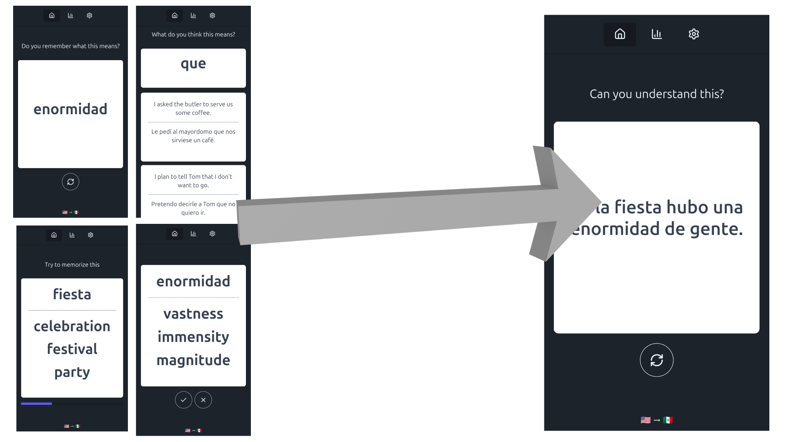

# Infinite Sentences Frontend



Data-driven language learning app.
Practice the vocabulary needed to understand a natural language sentence. Rinse, Repeat.

## Run

```bash
npm install
npm run dev      # dev server
npm run build    # production build
npm run lint     # lint
```

## Architecture

```
src/
├── app/              # App shell, router
├── pages/
│   ├── situation-practice/   # Main practice flow
│   │   └── tasks/            # Task types (memorize, recall, understand, challenge)
│   ├── stats/                # Progress stats, streaks
│   └── settings/             # User preferences
├── entities/
│   ├── practice-tracking/    # Pinia store for progress, streaks, daily counts
│   ├── user-settings/        # Pinia store for goals
│   ├── sentences/            # Sentence data loading
│   └── gloss/                # Vocabulary schema/types
└── dumb/                     # Stateless UI components
```

## Data

Sentence data loaded from `/infinite-sentences-data/{nativeIso}/{targetIso}/`. (via a git submodule)

## Tech

Vue 3, TypeScript, Vite, Tailwind + DaisyUI, Pinia, PWA.
